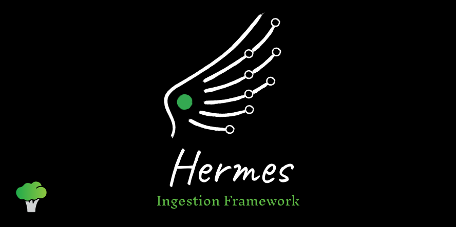

# Hermes



A simple **serverless-compatible Extract-Load framework** for building declarative data pipelines.

> ⚠️ Hermes is currently in **alpha** and is not yet recommended for production workloads.

---

## ✨ What is Hermes?

Hermes helps you define and execute data pipelines using simple YAML configuration files.

With Hermes, you can:
- Extract data from APIs, databases, or custom Python logic
- Load data into object storage or analytical destinations
- Define pipelines declaratively
- Keep execution logic separate from configuration
- Build lightweight and serverless-compatible data ingestion workflows

---

## 📦 Features

* YAML-based configuration
* Pluggable connector architecture
* Custom Python extractors
* Local and cloud-compatible destinations
* Serverless-friendly design
* Configuration validation and parsing CLI
* Modular project structure

---


## 🧱 Core Concepts

Hermes is built around three main concepts:

### 🛫 Sources
Sources define where data is extracted from.

Examples:

- REST APIs
- Databases
- Custom Python extractors

---

### 🛬 Destinations
Destinations define where data is loaded.

Examples:

- Local storage
- Amazon S3
- Athena Iceberg tables

---

### ✈️ Pipelines
Pipelines connect sources to destinations and define execution schedules.

**Pipeline Example** :

```yaml
sources:
  - name: currency_api
    description: Currency exchange rates
    type: custom
    config:
      extractor: CurrencyExtractor
      module_path: custom_connectors.currency
      tables:
        - name: rates
          data_key: rates
          kwargs:
            endpoint: "https://www.floatrates.com/daily/mad.json"

destinations:
  - name: local_output
    description: Local storage
    type: local_storage
    config:
      format: json
      bucket: ./artefacts/data

pipelines:
  - name: currency_pipeline
    sources:
      - name: currency_api
        tables: [rates]
    destinations:
      - local_output
    schedule: "0 12 * * *"
````

---

## 🚀 Quick Start

Initialize a Hermes project:

```bash
hermes init
```

Run a pipeline:

```bash
hermes pipeline run currency_pipeline
```

See the [Getting Started](getting_started.md) guide for a complete walkthrough.

---

## 🛠️ CLI Commands

### Initialize a project

```bash
hermes init
```

---

### Run a pipeline

```bash
hermes pipeline run <pipeline_name>
```

---

### List available pipelines

```bash
hermes pipeline list
```

---

### Debug your Hermes environment

```bash
hermes debug
```

---

## 📚 Documentation

* [Getting Started](getting_started.md)
* [Configuration Overview](reference/configuration.md)
* [Custom Source](reference/sources/custom.md)
* [Object Storage Destination](reference/destinations/object_storage.md)
* [Athena Iceberg Destination](reference/destinations/athena_iceberg.md)
* [Pipelines](reference/pipelines.md)

---

## 🧩 Architecture Philosophy

Hermes focuses on:

* Declarative configuration
* Lightweight execution
* Separation of configuration and code
* Simple extensibility through connectors

Hermes is designed to work well in:

* Serverless environments
* Containerized workloads
* Lightweight ingestion pipelines
* Cloud-native data platforms

---

## 🤝 Contributing

Hermes is an open-source project and contributions are welcome.

Repository:

[brocolidata/hermes](https://github.com/brocolidata/hermes?utm_source=chatgpt.com)

---

## ⚠️ Alpha Status

Hermes is under active development.

Breaking changes may occur as the framework evolves.
